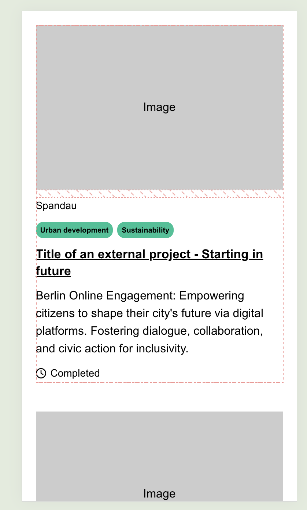
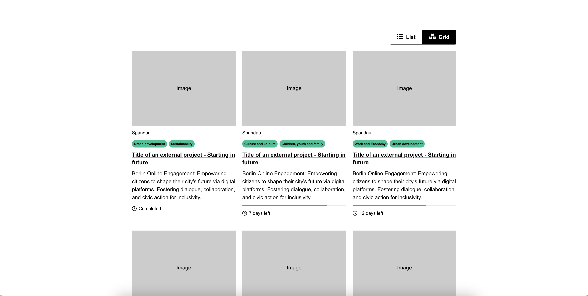
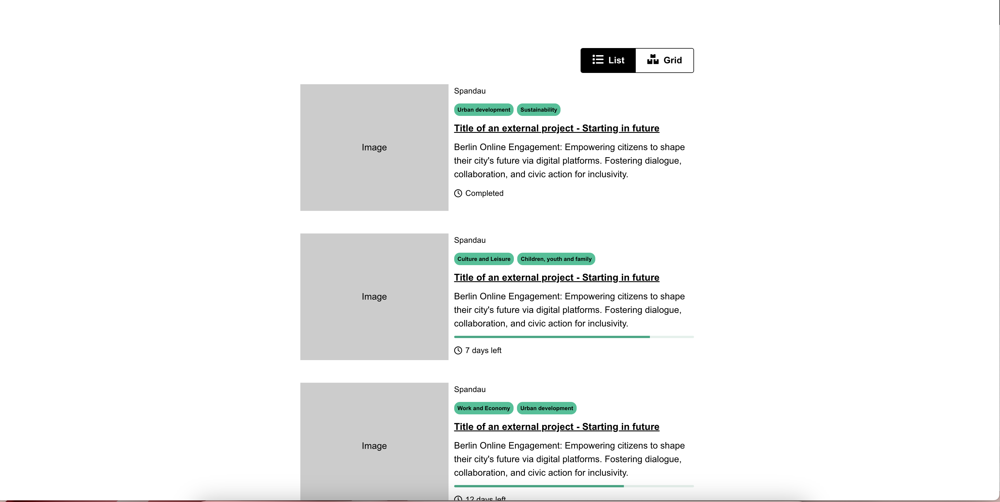

# Hélène Ruelle - Technical assignment

This project was bootstrapped with [Create React App](https://github.com/facebook/create-react-app). 

## Available Scripts

After cloning this repository locally, here are the scripts you can run to experience the code.\
Please run `npm install` before anything.

### `npm start`

Runs the app in the development mode.\
Open [http://localhost:3000](http://localhost:3000) to view it in your browser.

### `npm test`

Launches the test runner in the interactive watch mode.\
Testing in this app is very light and is based on React Testing library and Jest.

## Accessibility

The app prioritizes accessibility by using semantic HTML and ARIA labels. In desktop mode, the layout toggle buttons are fully accessible with keyboard navigation.

## Components

Let's focus on the 2 major components : 
- `ProjectCard`
- `CardLayout`

### `ProjectCard`

The API of this component is meant to receive a view ready version of the project object.
```
{
  "id": number,
  "title": string,
  "description": string,
  "tags": <string>,
  "location": string,
  "image": string,
  "completionPercentage": number,  
  "completionStatus": string,
  "daysUntilEndDate": number
}
```

➡ *Screenshot*

### `CardLayout`

This is the main component here, `CardLayout` displays a list of project cards in a responsive layout that switches between `grid` and `list` views based on device size and on user interaction, using the `useIsMobile` hook. Each project in the data set is rendered dynamically as `ProjectCard` component.

*Local state :* `CardLayout` controls its own state (`grid` or `list`) using the `useState` hook. Any UI updates are CSS controlled via a flexbox layout. As the state is not passed down children components, except for `CardLayoutToggle` which is fully controlled by its parents, CardLayout's CSS file is responsible for the UI changes inside the `ProjectCard` component UI, performing styling overwrites.

#### Mobile version
The mobile version of this layout is, by default and without a possible change, in `list` state. The toggle component is not displayed. Even though the state of the layout is `list`, the appearance of the each project card is slightly different from the desktop `list`.

➡ *Screenshot*


#### Desktop version
Desktop users can toggle between views via the `CardLayoutToggle` component with a default value on `grid`.

➡ *Screenshot (grid layout)*


➡ *Screenshot (list layout)*


## Custom hook

The `useIsMobile` hook keeps things simple by detecting if the user is on a mobile device. It listens for window resize events and updates dynamically, so the app can adjust layouts seamlessly. This hook helps make the app responsive and keeps the layout optimized for different screen sizes without cluttering the components with device-specific logic.

## Error handling

The app is built to handle errors smoothly and keep things running without crashing. At the root level, we have an `ErrorBoundary` that catches any unexpected errors in the component tree and shows a fallback message instead of breaking the app. On top of that, the `App` component has its own safety net with an error state. If something goes wrong during data fetching, it skips rendering the `CardLayout` and shows an error message instead. This setup ensures that both big and small issues are handled gracefully, keeping the app stable and user-friendly.

## Ways forward

### Further Test Proofing
Enhance the test coverage by simulating more edge cases and integrating end-to-end (E2E) testing to validate user workflows comprehensively.

### Typing with TypeScript
Transition the app to TypeScript for improved type safety and maintainability, as prop-types is being deprecated by React. This ensures better developer experience and minimizes runtime errors.

### Component refactor
We can refactor the `ProjectCard` component by breaking it into smaller, leaf components. This would enhance modularity, improve reusability, and make the codebase easier to maintain and extend in the future.

